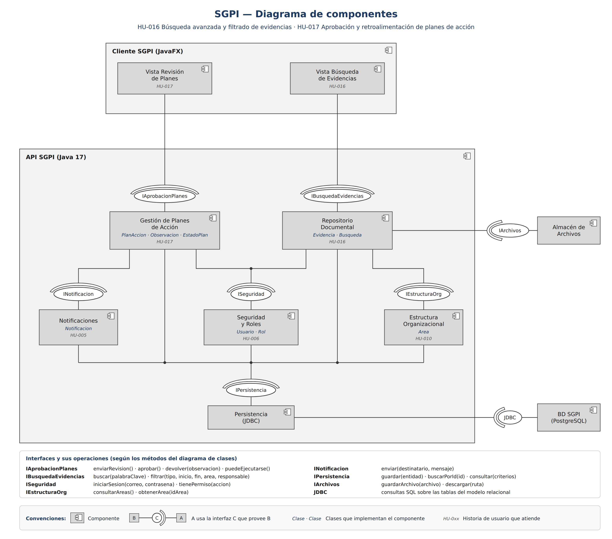
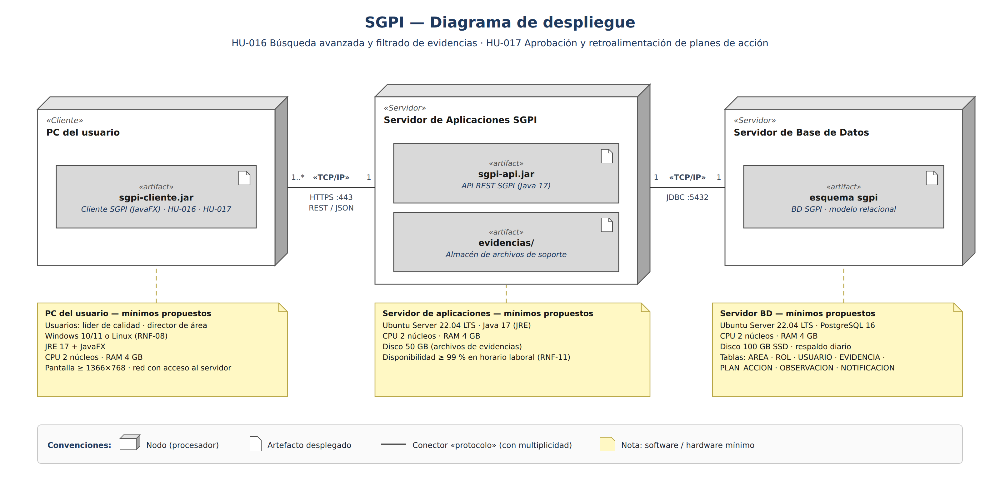
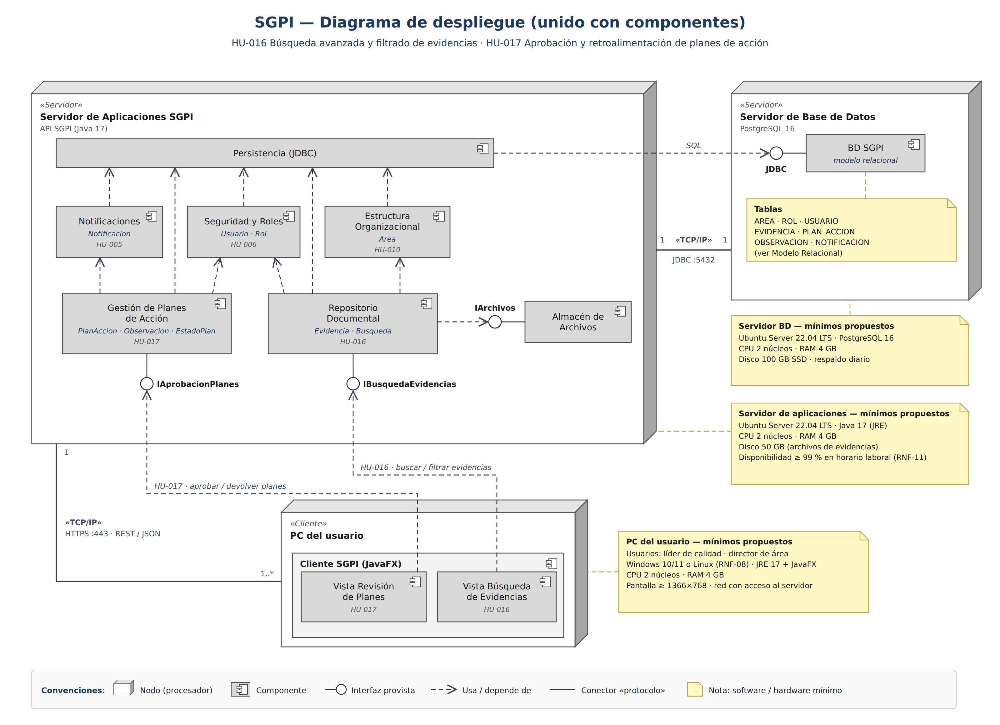

# Arquitectura del SGPI — Diseño de HU-016 y HU-017

Diagramas de diseño para los dos casos de uso elegidos en el ejercicio de la Sesión 15 (Análisis y diseño de software):

- **HU-016** — Búsqueda avanzada y filtrado de evidencias (líder de calidad).
- **HU-017** — Aprobación y retroalimentación de planes de acción (director de área).

Las imágenes están en la carpeta [`/Graficas`](../../Graficas).

## 1. Diagrama de clases

- Clases del dominio de las dos HU: `Usuario`, `Rol`, `Area`, `Busqueda`, `Evidencia`, `PlanAccion`, `EstadoPlan` (enumeración), `Observacion` y `Notificacion`.
- Un `Usuario` tiene un `Rol` y pertenece a un `Area`; es responsable de evidencias, realiza búsquedas, coordina o dirige planes de acción y es destinatario de notificaciones.
- `PlanAccion` contiene sus `Observacion` (composición), genera `Notificacion` y usa `EstadoPlan` para su estado.
- `Busqueda` usa `Evidencia` («use») para buscar y filtrar; cada `Evidencia` está clasificada en un `Area`.

## 2. Modelo relacional de la base de datos

- Siete tablas: `AREA`, `ROL`, `USUARIO`, `EVIDENCIA`, `PLAN_ACCION`, `OBSERVACION` y `NOTIFICACION`.
- `USUARIO` referencia a `ROL` y `AREA`; `correo` es único.
- `EVIDENCIA` referencia al usuario responsable y al área.
- `PLAN_ACCION` referencia al coordinador y al director (ambos en `USUARIO`).
- `OBSERVACION` referencia al plan y a su autor; `NOTIFICACION` referencia al usuario destinatario y, de forma opcional, al plan.

## 3. Diagrama de componentes

- Notación de la Sesión 15: componente con ícono, interfaz provista (bola) e interfaz requerida (media luna).
- El cliente es una aplicación web que corre en el navegador. Sus vistas usan `IAprobacionPlanes` e `IBusquedaEvidencias`, que el backend (Java 17 · Spring) expone como API REST (HTTPS · JSON).
- Cada componente indica las clases del diagrama de clases que lo implementan y la historia de usuario que atiende.
- El recuadro inferior define las operaciones de cada interfaz a partir de los métodos del diagrama de clases.

## 4. Diagrama de despliegue

- Tres nodos: «Cliente» PC del usuario (con el navegador web como entorno de ejecución), «Servidor» de aplicaciones y «Servidor» de base de datos.
- En el servidor de aplicaciones se despliegan la API REST (`sgpi-api.jar`), los archivos de la interfaz web (`sgpi-web/`) y la carpeta de evidencias. El navegador descarga la interfaz web de ese servidor y la ejecuta.
- Conectores «TCP/IP» con su protocolo (HTTPS y JDBC) y multiplicidad.
- Notas con las propiedades mínimas de software y hardware de cada nodo.

## 5. Diagrama de despliegue unido con componentes

Mismos nodos y conectores del punto 4, con los componentes del punto 3 ubicados dentro de cada nodo (formato de la diapositiva "Uniendo diagrama de despliegue con componentes"). Las vistas web quedan en el PC del usuario porque se ejecutan en el navegador.

## Supuestos pendientes de confirmar por el equipo

| Tema | Supuesto usado en los diagramas | Fuente |
|---|---|---|
| Cliente | Aplicación web en el navegador (Chrome, Edge o Firefox); la interfaz la sirve el mismo servidor de aplicaciones | Cronograma de desarrollo (frontend web). La Propuesta todavía menciona JavaFX en la sección 3 y en el RNF-06 |
| Backend | Java 17 + Spring con API REST | Cronograma de desarrollo |
| Comunicación cliente–servidor | HTTPS (puerto 443): interfaz web y API REST con JSON | Propuesto en estos diagramas; no definido en otro documento |
| Base de datos | PostgreSQL 16, acceso por JDBC (puerto 5432) | RNF-09 (PostgreSQL o MySQL); el cronograma deja PostgreSQL por confirmar |
| Hardware mínimo | 2 núcleos, 4 GB de RAM, discos de 50 GB (aplicaciones) y 100 GB (BD) | Propuesto en estos diagramas; no definido en otro documento |
| Filtro de evidencias | `filtrar(tipo, inicio, fin, area, responsable)` | HU-016 pide filtrar por tipo, fecha, área o responsable. En el diagrama de clases `Busqueda.filtrar` solo recibe `tipo`, `inicio` y `fin` |
| Plan devuelto | Sin decidir | El CU-01 dice que un plan devuelto vuelve a "En borrador", pero `EstadoPlan` no tiene ese valor ni uno de devuelto |

Si el equipo elige MySQL, hay que actualizar los dos diagramas de despliegue. Si confirma PostgreSQL, hay que cambiar en el modelo relacional `DATETIME` (tipo de MySQL) por `TIMESTAMP`.
