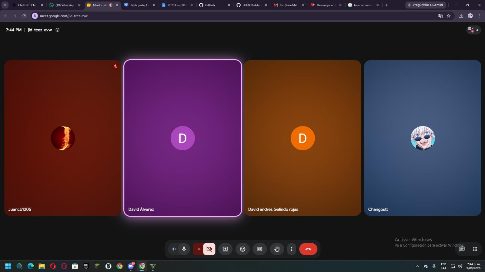
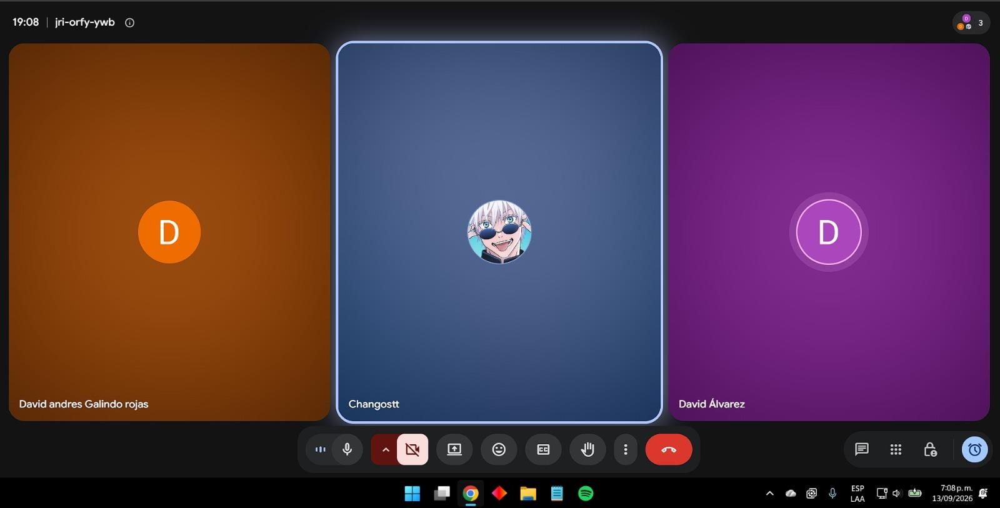
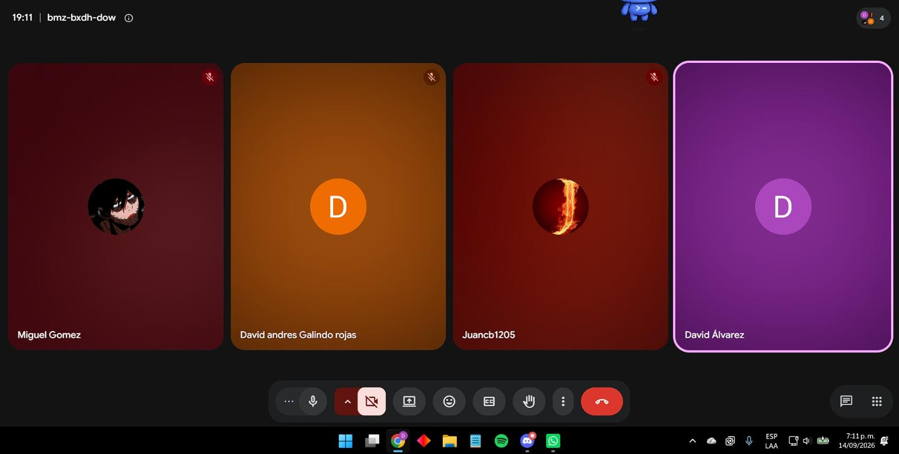

# Actas de Reunión

**Entregable 2, Gestión y Reportes**
SGPI: Sistema de Gestión de Procesos Institucionales
Grupo Los FIS
Pontificia Universidad Javeriana, Facultad de Ingeniería

> Versión en Markdown de `Actas de Reunión_Los FIS_SGPI_Entrega 1.pdf`.

---

## 1. Criterio de elaboración

Las siguientes actas registran las reuniones de seguimiento realizadas durante el desarrollo del proyecto SGPI. La idea es resumir el objetivo de cada reunión, los temas tratados, las decisiones y acuerdos y, por último, los compromisos que cada miembro del grupo está dispuesto a realizar. Como evidencia fotográfica de cada reunión, se tomaron capturas correspondientes, las cuales muestran los asistentes a la reunión y el día de captura.

---

## Acta 1. Revisión inicial del avance del proyecto

| Campo | Detalle |
|---|---|
| Fecha | 09 de septiembre de 2026 |
| Asistentes | Miguel Ángel Gómez David Andrés Galindo Rojas Juan Sebastián Martínez David Álvarez Rodríguez |
| Duración | 15 minutos |
| Responsable del acta | David Álvarez Rodríguez |
| Objetivos | Revisar el estado inicial del proyecto y verificar los avances realizados por los miembros del grupo. |

**Temas tratados:**

- Revisión general del estado del proyecto.
- Verificación de los avances realizados por cada miembro.
- Revisión de la organización del proyecto y de los entregables pendientes.
- Identificación de los elementos que deben continuar desarrollándose.

**Decisiones y acuerdos:**

- Continuar con el desarrollo de los entregables asignados.
- Mantener comunicación entre los miembros para revisar los avances.
- Registrar evidencia de trabajo realizado mediante capturas.

**Compromisos:**

Cada miembro debía continuar con las actividades asignadas y avanzar en los documentos correspondientes para la siguiente revisión.

**Evidencia Acta 1:**

---

## Acta 2. Seguimiento del avance y revisión de entregables

| Campo | Detalle |
|---|---|
| Fecha | 13 de septiembre de 2026 |
| Asistentes | Miguel Ángel Gómez David Andrés Galindo Rojas David Álvarez Rodríguez |
| Duración | 10 minutos |
| Responsable del acta | David Álvarez Rodríguez |
| Objetivo | Verificar el avance del proyecto respecto a la primera revisión. Comprobar el estado de los documentos y actividades desarrolladas. |

**Temas tratados:**

- Revisión de los avances realizados desde la primera reunión.
- Verificación de los documentos actualizados.
- Revisión del estado del WBS y del organigrama.
- Identificación de actividades pendientes antes de la siguiente revisión.
- Registro de evidencia de avance.

**Decisiones y acuerdos:**

- Continuar con las modificaciones pendientes de los documentos.
- Revisar qué entregables mantienen coherencia entre sí.
- Mantener las evidencias de avance para la documentación final.

**Compromisos:**

Continuar con las actividades pendientes y realizar una nueva revisión del estado del proyecto.

**Evidencia Acta 2:**

---

## Acta 3. Revisión y consolidado de avances

| Campo | Detalle |
|---|---|
| Fecha | 14 de septiembre de 2026 |
| Asistentes | Miguel Ángel Gómez David Andrés Galindo Rojas Juan Sebastián Martínez David Álvarez Rodríguez |
| Duración | 12 minutos |
| Responsable del acta | David Álvarez Rodríguez |
| Objetivo | Realizar una revisión del estado actual del proyecto y verificar los avances realizados por el grupo. |

**Temas tratados:**

- Revisión de los documentos modificados.
- Verificación de los avances realizados por los miembros.
- Revisión de los elementos pendientes del entregable.
- Organización de las evidencias correspondientes al trabajo realizado.
- Registro de la reunión como evidencia del seguimiento del proyecto.

**Decisiones y acuerdos:**

- Continuar con la revisión y corrección de los documentos pendientes.
- Consolidar las evidencias obtenidas durante el desarrollo del proyecto.
- Mantener actualizado el repositorio y los documentos correspondientes.

**Compromisos:**

Finalizar modificaciones pendientes y continuar con la preparación de los entregables del proyecto.

**Evidencia Acta 3:**

