# Informe de Resultados

**Entregable 4, Gestión y Reportes**
SGPI: Sistema de Gestión de Procesos Institucionales
Grupo Los FIS
Pontificia Universidad Javeriana, Facultad de Ingeniería

> Versión en Markdown de `Informe de Resultados_Los FIS_SGPI_Entrega 1.pdf`.

---

## 1. Identificación

| Elemento | Información |
|---|---|
| Proyecto | SGPI: Sistema de Gestión de Procesos Institucionales |
| Grupo | Los FIS |
| Cliente / Product Owner | Ing. Kerwin Barros |
| Institución | Pontificia Universidad Javeriana, Facultad de Ingeniería |
| Estado | Proyecto en desarrollo |

## 2. Objetivo del informe

El presente Informe de Resultados tiene como objetivo consolidar los principales resultados obtenidos. Se presentan los elementos de planificación, organización, documentación y seguimiento desarrollados hasta el momento, junto con las evidencias correspondientes.

## 3. Resultados de la planificación y organización

La planificación del proyecto permitió organizar las actividades alrededor de las 20 historias de usuario y relacionarlas con los elementos de gestión utilizados por el equipo. El WBS permitió representar la estructura general del trabajo, mientras que el Organigrama permitió establecer las responsabilidades de los integrantes.

El calendario de actividades, junto con los Sprints, Issues y Milestones, permitió organizar el trabajo previsto. El tablero Kanban complementa esta planificación al permitir visualizar el estado de las actividades durante el desarrollo.

## 4. Resultados de documentación y gestión

La documentación del proyecto fue organizada mediante diferentes entregables y componentes del repositorio. Se cuenta con el Lean Canvas, los requisitos funcionales y no funcionales, el WBS, el Organigrama, el calendario de actividades, la Wiki, las Actas de Reuniones y el Reporte Gerencial.

Esta documentación permite mantener una referencia común para el equipo y facilita el seguimiento de los avances, las actividades pendientes y la estructura general del proyecto.

## 5. Resultados de gestión en GitHub

Se organizó el repositorio del proyecto SGPI y se configuraron los elementos de gestión utilizados por el equipo. Las Issues permiten relacionar las actividades con las historias de usuario, mientras que los Sprints y Milestones permiten organizar el trabajo. El tablero Kanban facilita la visualización del estado de las actividades y la Wiki centraliza información relacionada con el proyecto.

## 6. Seguimiento y trabajo del equipo

Realizamos reuniones de seguimiento (Dailys) para revisar los avances, las actividades pendientes y la documentación desarrollada. Estas reuniones fueron registradas mediante Actas de Reuniones, incluyendo la información correspondiente a los encuentros realizados.

El seguimiento también se complementa con la actualización de los elementos de GitHub y con la consolidación periódica de los documentos oficiales del proyecto.

## 7. Evidencias del desarrollo

En esta sección se deben anexar las capturas que permitan verificar los principales resultados obtenidos durante el desarrollo del proyecto.

### 7.1. WBS

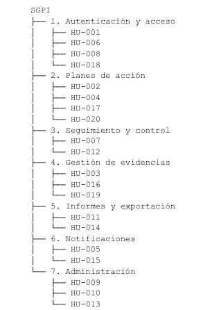

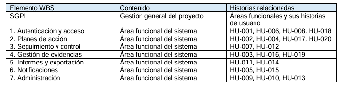

### 7.2. Organigrama

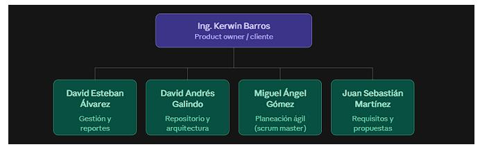

### 7.3. Requisitos

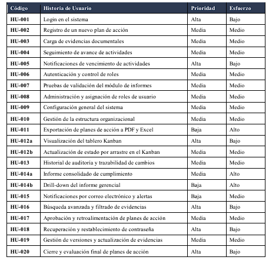

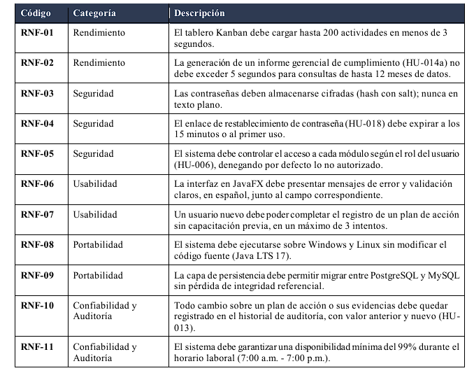

### 7.4. Labels

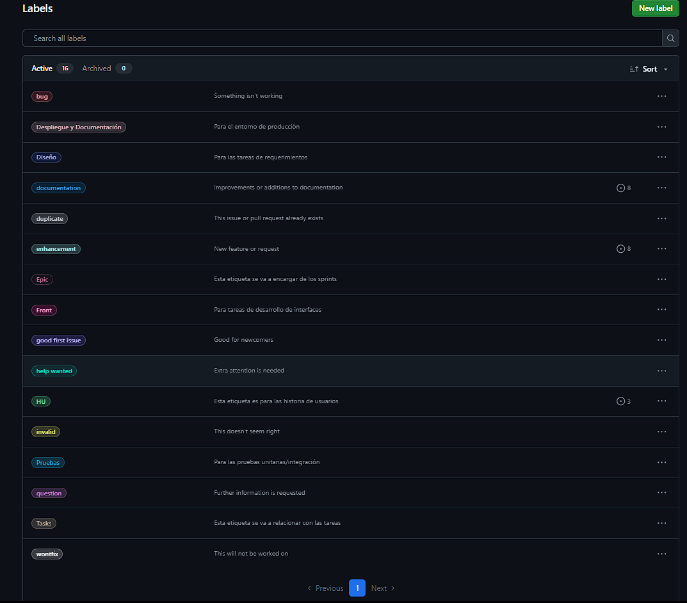

### 7.5. GitHub Projects

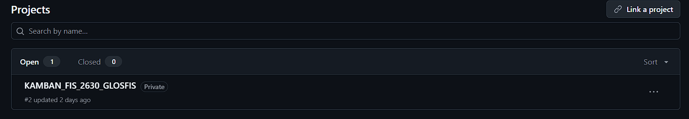

### 7.6. Tablero Kanban

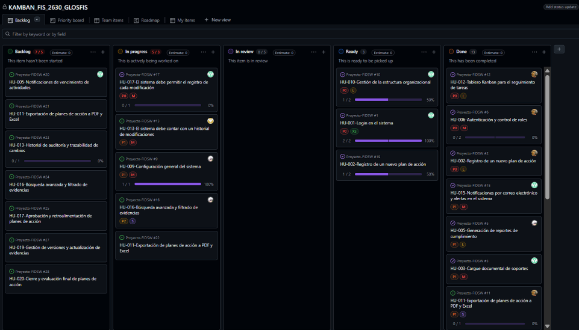

### 7.7. Issues

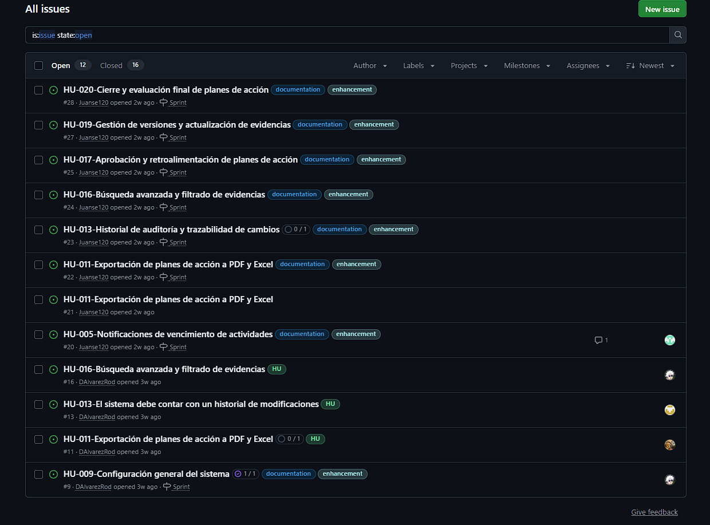

### 7.8. Sprints y Milestones

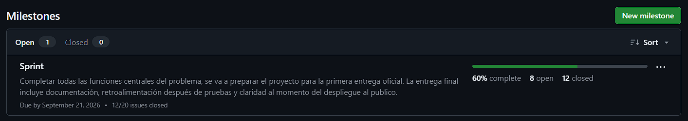

### 7.9. Wiki

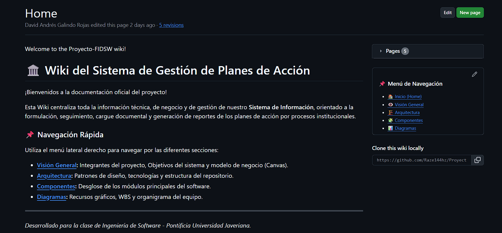

### 7.10. Estructura del repositorio

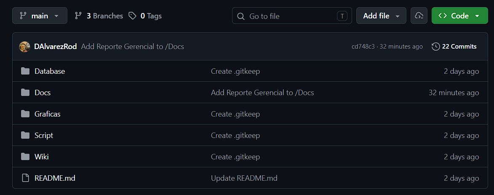

## 8. Estado actual y actividades pendientes

SGPI continúa en desarrollo. Las actividades pendientes se concentran en continuar el seguimiento de las historias de usuario, mantener actualizados los elementos de gestión y la documentación, realizar las reuniones necesarias y consolidar las evidencias correspondientes.

- Continuar con el desarrollo y seguimiento de las 20 historias de usuario.
- Mantener actualizados los Issues, Sprints, Milestones y el tablero Kanban.
- Continuar con la actualización de la Wiki, la estructura del repositorio y los documentos oficiales.
- Realizar y documentar las reuniones de seguimiento que sean necesarias.
- Revisar y consolidar los entregables desarrollados por el equipo.
- Completar la recopilación y organización de las evidencias del proyecto.

## 9. Conclusiones

Durante el desarrollo de SGPI, establecimos una estructura de trabajo que integra la planificación, la definición de requisitos, la organización del equipo, la gestión del repositorio y el seguimiento de las actividades. Los resultados obtenidos permiten contar con una base documental y de gestión para continuar con el desarrollo del proyecto.

El proyecto permanece en desarrollo, por lo que los elementos de planificación, documentación, seguimiento y evidencias continuarán actualizándose conforme avance el trabajo del equipo.
