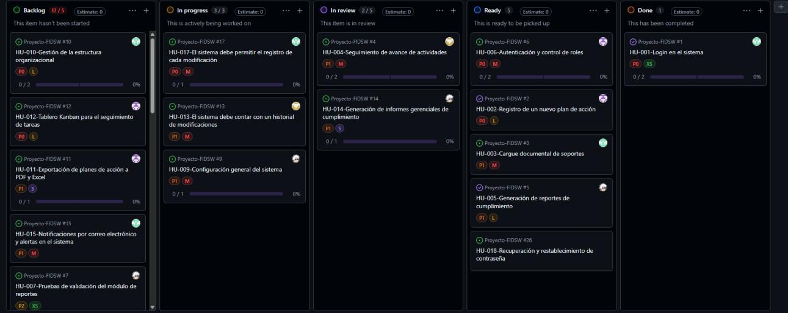

# Fundamentos Ingeniería de SW: Propuesta del Proyecto y Requisitos del Sistema

**Pontificia Universidad Javeriana** · Facultad de Ingeniería · Departamento de Ingeniería de Sistemas
**Fundamentos Ingeniería de SW**

**Autores:**
- David Esteban Álvarez
- David Andrés Galindo
- Miguel Ángel Gómez
- Juan Sebastián Martínez

Bogotá D.C., 10 de septiembre de 2026

> Versión en Markdown de `Propuesta_y_Requisitos_FIDSW.docx` / `.pdf` (Entrega 1).

---

## 1. Propuesta del Proyecto — Lean Canvas

El sistema surge para resolver la dispersión de la información y la dificultad de seguimiento a los planes de acción institucionales mediante una plataforma digital centralizada. A continuación se presenta el modelo de negocio consolidado en formato Lean Canvas.

| Bloque | Contenido |
|---|---|
| **Problema** | Dispersión de la información institucional; tiempo excesivo en tareas manuales; dificultad para hacer seguimiento adecuado a los planes de acción. |
| **Solución** | Plataforma digital que centraliza el registro, cargue documental, seguimiento y generación de reportes de los planes de acción. |
| **Propuesta de Valor Única** | Sistema de información orientado a la formulación, seguimiento, cargue de documentos de soporte y generación automática de reportes de cumplimiento de los planes de acción. |
| **Ventaja Especial** | Sistema especializado (no una hoja de cálculo genérica) para la gestión de planes institucionales, con reportes automáticos e indicadores actualizados en tiempo real. |
| **Segmento de Clientes** | Entidades públicas, instituciones académicas, oficinas de calidad y coordinadores de procesos. |
| **Alternativas Actuales** | Excel, Google Sheets, Word, Google Drive, archivos físicos y correo electrónico. |
| **Métricas Clave** | Número de planes de acción activos; porcentaje de actividades cumplidas; tiempo de generación de reportes. |
| **Canales** | Páginas web institucionales, correo institucional, capacitaciones internas. |
| **Early Adopters** | Oficinas de calidad, instituciones "manuales", coordinadores de procesos, directores administrativos. |
| **Estructura de Costos** | Desarrollo del software, infraestructura, alojamiento en la nube, mantenimiento y soporte, actualizaciones, seguridad. |
| **Flujo de Ingresos** | Licenciamiento por institución, suscripción mensual/anual, servicios de implementación, recursos del área de TI, financiación institucional. |

## 2. Requisitos Funcionales

### 2.1 Backlog Consolidado de Historias de Usuario

Backlog refinado y priorizado (22 historias), resultante de la división de HU-012 y HU-014 en pares independientes tras la revisión INVEST y la retroalimentación cruzada del equipo.

| Código | Historia de Usuario | Prioridad | Esfuerzo |
|---|---|---|---|
| **HU-001** | Login en el sistema | Alta | Bajo |
| **HU-002** | Registro de un nuevo plan de acción | Media | Medio |
| **HU-003** | Carga de evidencias documentales | Media | Medio |
| **HU-004** | Seguimiento de avance de actividades | Media | Medio |
| **HU-005** | Notificaciones de vencimiento de actividades | Alta | Bajo |
| **HU-006** | Autenticación y control de roles | Media | Medio |
| **HU-007** | Pruebas de validación del módulo de informes | Media | Medio |
| **HU-008** | Administración y asignación de roles de usuario | Media | Medio |
| **HU-009** | Configuración general del sistema | Media | Medio |
| **HU-010** | Gestión de la estructura organizacional | Media | Medio |
| **HU-011** | Exportación de planes de acción a PDF y Excel | Baja | Alto |
| **HU-012a** | Visualización del tablero Kanban | Alta | Bajo |
| **HU-012b** | Actualización de estado por arrastre en el Kanban | Media | Medio |
| **HU-013** | Historial de auditoría y trazabilidad de cambios | Media | Medio |
| **HU-014a** | Informe consolidado de cumplimiento | Media | Alto |
| **HU-014b** | Drill-down del informe gerencial | Baja | Alto |
| **HU-015** | Notificaciones por correo electrónico y alertas | Baja | Medio |
| **HU-016** | Búsqueda avanzada y filtrado de evidencias | Alta | Bajo |
| **HU-017** | Aprobación y retroalimentación de planes de acción | Media | Medio |
| **HU-018** | Recuperación y restablecimiento de contraseña | Alta | Bajo |
| **HU-019** | Gestión de versiones y actualización de evidencias | Media | Medio |
| **HU-020** | Cierre y evaluación final de planes de acción | Alta | Bajo |

### 2.2 Casos de Uso Principales

A continuación se detallan los tres casos de uso principales del sistema, correspondientes al flujo central de formulación, evidencia y seguimiento de los planes de acción.

#### CU-01. Registro de un Plan de Acción

**Actor principal:** Coordinador de Procesos

**Precondiciones:** El usuario ha iniciado sesión con un rol que tiene permiso para crear planes de acción (HU-002, HU-006).

**Flujo principal:**

1. El coordinador selecciona la opción "Nuevo plan de acción".
2. El sistema presenta el formulario de registro (objetivos, fechas, área responsable).
3. El coordinador diligencia los campos obligatorios y confirma el guardado.
4. El sistema valida la información, asigna un código único al plan y lo registra con estado "En borrador".
5. El sistema muestra un mensaje de confirmación y ubica el plan en el listado del área.

**Flujos alternativos / excepciones:**

- Si faltan campos obligatorios, el sistema resalta los campos pendientes y no guarda el plan (HU-002).
- Si el director de área devuelve el plan con observaciones, este regresa a estado "En borrador" para ajustes (HU-017).

**Postcondición:** Queda registrado un nuevo plan de acción con código único, trazable y asociado a un área, listo para iniciar el cargue de evidencias y el seguimiento.

#### CU-02. Carga de Evidencias Documentales

**Actor principal:** Responsable de Actividad

**Precondiciones:** Existe un plan de acción con al menos una actividad registrada, y el usuario tiene permisos sobre esa actividad.

**Flujo principal:**

1. El responsable selecciona la actividad a la que quiere adjuntar soporte.
2. El sistema presenta la opción de cargar archivo.
3. El responsable selecciona el archivo (máximo 20 MB, formato permitido) y confirma la carga.
4. El sistema valida tamaño y formato, y almacena la evidencia asociada a la actividad.
5. El sistema actualiza el historial de auditoría con el registro de la carga (HU-013).

**Flujos alternativos / excepciones:**

- Si el archivo excede 20 MB o el formato no está permitido, el sistema rechaza la carga e informa el motivo.
- Si ya existe una evidencia previa para la actividad, el sistema ofrece cargarla como nueva versión conservando el historial (HU-019).

**Postcondición:** La actividad queda con al menos un soporte documental válido, disponible para consulta, auditoría y como respaldo del avance reportado.

#### CU-03. Mover una Actividad en el Tablero Kanban

**Actor principal:** Coordinador de Procesos

**Precondiciones:** El coordinador ha accedido a la vista Kanban de un plan de acción con actividades clasificadas por estado (HU-012a).

**Flujo principal:**

1. El sistema muestra las tarjetas de las actividades agrupadas en las columnas Por hacer, En proceso y Finalizado.
2. El coordinador arrastra una tarjeta desde su columna actual hacia la columna destino.
3. El sistema valida la regla de negocio asociada al nuevo estado.
4. El sistema actualiza el estado de la actividad y recalcula el porcentaje de avance general del plan (HU-004).
5. El sistema registra el cambio de estado en el historial de auditoría (HU-013).

**Flujos alternativos / excepciones:**

- Si la tarjeta se mueve a "Finalizado" y la actividad no tiene una evidencia documental cargada, el sistema bloquea el movimiento y notifica al usuario (regla validada por el Product Owner).
- Si el usuario no tiene permisos sobre esa actividad, el sistema no permite el arrastre.

**Postcondición:** La actividad refleja su estado real de ejecución, el avance del plan queda recalculado y el cambio queda trazado en el historial.

## 3. Requisitos No Funcionales

Requisitos no funcionales agrupados por categoría, derivados de las reglas de negocio validadas por el Product Owner y de las características técnicas del sistema (Java 17, JavaFX, base de datos relacional).

| Código | Categoría | Descripción |
|---|---|---|
| **RNF-01** | Rendimiento | El tablero Kanban debe cargar hasta 200 actividades en menos de 3 segundos. |
| **RNF-02** | Rendimiento | La generación de un informe gerencial de cumplimiento (HU-014a) no debe exceder 5 segundos para consultas de hasta 12 meses de datos. |
| **RNF-03** | Seguridad | Las contraseñas deben almacenarse cifradas (hash con salt); nunca en texto plano. |
| **RNF-04** | Seguridad | El enlace de restablecimiento de contraseña (HU-018) debe expirar a los 15 minutos o al primer uso. |
| **RNF-05** | Seguridad | El sistema debe controlar el acceso a cada módulo según el rol del usuario (HU-006), denegando por defecto lo no autorizado. |
| **RNF-06** | Usabilidad | La interfaz en JavaFX debe presentar mensajes de error y validación claros, en español, junto al campo correspondiente. |
| **RNF-07** | Usabilidad | Un usuario nuevo debe poder completar el registro de un plan de acción sin capacitación previa, en un máximo de 3 intentos. |
| **RNF-08** | Portabilidad | El sistema debe ejecutarse sobre Windows y Linux sin modificar el código fuente (Java LTS 17). |
| **RNF-09** | Portabilidad | La capa de persistencia debe permitir migrar entre PostgreSQL y MySQL sin pérdida de integridad referencial. |
| **RNF-10** | Confiabilidad y Auditoría | Todo cambio sobre un plan de acción o sus evidencias debe quedar registrado en el historial de auditoría, con valor anterior y nuevo (HU-013). |
| **RNF-11** | Confiabilidad y Auditoría | El sistema debe garantizar una disponibilidad mínima del 99% durante el horario laboral (7:00 a.m. - 7:00 p.m.). |

## 4. Anexo — Evidencia de GitHub Projects

*Captura del tablero "KAMBAN_FIS_2630_GLOSFIS" que certifica el cumplimiento de los criterios de refinamiento, mostrando las 5 historias aprobadas y listas para inicio de desarrollo en la columna Ready (HU-006, HU-002, HU-003, HU-005 y HU-018), junto con el estado del backlog general.*

