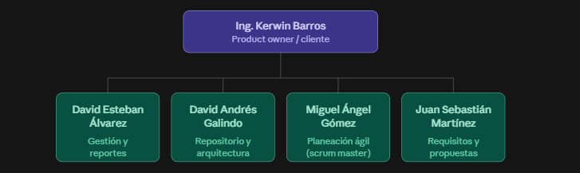

# WBS y Organigrama del Proyecto

**Entregable 1, Gestión y Reportes**
SGPI: Sistema de Gestión de Procesos Institucionales
Grupo Los FIS

- David Galindo Rojas
- Miguel Ángel Gómez
- Juan Sebastián Gómez
- David Álvarez Rodríguez

Pontificia Universidad Javeriana, Facultad de Ingeniería

> Versión en Markdown de `WBS y Organigrama_Los FIS_SGPI_Entrega 1.pdf`.

---

## 1. Contexto del proyecto

SGPI se organizó mediante un WBS, agrupando las 20 historias de usuario en grupos funcionales que cuenten con una relación entre sí. Esta estructura permite representar de forma jerárquica el alcance del proyecto y facilita la planificación, asignación y seguimiento de las actividades.

Durante este proceso se revisó cada una de las historias mediante criterios de análisis como INVEST. Se establecieron prioridades y se definieron criterios de aceptación utilizando la estructura Given/When/Then. Esto permitió describir de forma clara el contexto de cada historia, la acción que debe realizar el usuario o el sistema y el resultado esperado de la funcionalidad.

Además, cada historia fue complementada con sub-historias que permiten descomponer el trabajo necesario para su desarrollo, incluyendo actividades de implementación, validación y pruebas. También se estableció una Definition of Done, que es un conjunto de condiciones que deben cumplirse antes de considerar una historia terminada. Algunos ejemplos de DoD pueden ser la validación funcional, la ejecución de pruebas, la integración del trabajo y la aprobación correspondiente.

Finalmente, las historias de usuario fueron gestionadas mediante el tablero Kaban de GitHub, con GitHub Issues y GitHub Projects, utilizando estados, etiquetas y criterios de seguimiento para organizar el trabajo del equipo. Esta estructura permite relacionar cada funcionalidad con su trabajo de desarrollo y visualizar el avance del proyecto mediante un tablero de seguimiento.

## 2. WBS del proyecto

La estructura se organiza en tres niveles: Nivel 1: SGPI. Nivel 2: Contenido. Nivel 3: Historias de usuario relacionadas. La clasificación de las historias sigue la agrupación definida para el proyecto.

| Elemento WBS | Contenido | Historias relacionadas |
|---|---|---|
| SGPI | Gestión general del proyecto | Áreas funcionales y sus historias de usuario |
| 1. Autenticación y acceso | Área funcional del sistema | HU-001, HU-006, HU-008, HU-018 |
| 2. Planes de acción | Área funcional del sistema | HU-002, HU-004, HU-017, HU-020 |
| 3. Seguimiento y control | Área funcional del sistema | HU-007, HU-012 |
| 4. Gestión de evidencias | Área funcional del sistema | HU-003, HU-016, HU-019 |
| 5. Informes y exportación | Área funcional del sistema | HU-011, HU-014 |
| 6. Notificaciones | Área funcional del sistema | HU-005, HU-015 |
| 7. Administración | Área funcional del sistema | HU-009, HU-010, HU-013 |

### 2.1. Estructura jerárquica

```
SGPI
├── 1. Autenticación y acceso
│    ├── HU-001
│    ├── HU-006
│    ├── HU-008
│    └── HU-018
├── 2. Planes de acción
│    ├── HU-002
│    ├── HU-004
│    ├── HU-017
│    └── HU-020
├── 3. Seguimiento y control
│    ├── HU-007
│    └── HU-012
├── 4. Gestión de evidencias
│    ├── HU-003
│    ├── HU-016
│    └── HU-019
├── 5. Informes y exportación
│    ├── HU-011
│    └── HU-014
├── 6. Notificaciones
│    ├── HU-005
│    └── HU-015
└── 7. Administración
     ├── HU-009
     ├── HU-010
     └── HU-013
```

## 3. Detalle del WBS por historias

| ID | Historia de usuario | Prioridad |
|---|---|---|
| HU-001 | Login en el sistema | Alta |
| HU-002 | Registro de planes de acción | Media |
| HU-003 | Carga de evidencias documentales | Media |
| HU-004 | Seguimiento de avance de actividades | Media |
| HU-005 | Notificaciones de vencimiento de actividades | Alta |
| HU-006 | Autenticación y control de roles | Media |
| HU-007 | Pruebas de validación del módulo de informes | Media |
| HU-008 | Administración y asignación de roles de usuario | Media |
| HU-009 | Configuración general del sistema | Media |
| HU-010 | Gestión de la estructura organizacional | Media |
| HU-011 | Exportación de planes de acción a PDF y Excel | Baja |
| HU-012a | Visualización del tablero Kanban | Alta |
| HU-012b | Actualización de estado por arrastre en Kanban | Media |
| HU-013 | Historial de auditoría y trazabilidad de cambios | Media |
| HU-014a | Informe consolidado de cumplimiento | Media |
| HU-014b | Drill-down del informe gerencial | Baja |
| HU-015 | Notificaciones por correo y alertas en el sistema | Baja |
| HU-016 | Búsqueda avanzada y filtrado de evidencias | Alta |
| HU-017 | Aprobación y retroalimentación de planes de acción | Media |
| HU-018 | Recuperación y restablecimiento de contraseña | Alta |
| HU-019 | Gestión de versiones y actualización de evidencias | Media |
| HU-020 | Cierre y evaluación final de planes de acción | Alta |

## 4. Organigrama

El organigrama representa la distribución de responsabilidades y funciones para el desarrollo del proyecto. Cada integrante tiene asignado un rol principal de acuerdo con las actividades que se deben realizar, incluyendo la gestión y seguimiento, la planeación ágil, los aspectos técnicos y la definición de requisitos y propuestas.

Nuestro equipo trabaja bajo la orientación del Product Owner/Cliente, Ing. Kerwin Barros, quien representa al cliente y valida que el desarrollo responda a las necesidades planteadas, de esta manera, el organigrama permite identificar fácilmente quién es responsable de cada área y cómo se organiza el equipo durante el desarrollo del proyecto.



| Integrante | Rol para el organigrama |
|---|---|
| David Esteban Álvarez | Responsable de Gestión y Reportes |
| David Andrés Galindo | Responsable del Repositorio y Arquitectura (Líder Técnico) |
| Miguel Ángel Gómez | Responsable de Planeación Ágil (Scrum Master) |
| Juan Sebastían Martínez | Responsable de Requisitos y Propuestas |

Product Owner / Cliente: Ing. Kerwin Barros.
